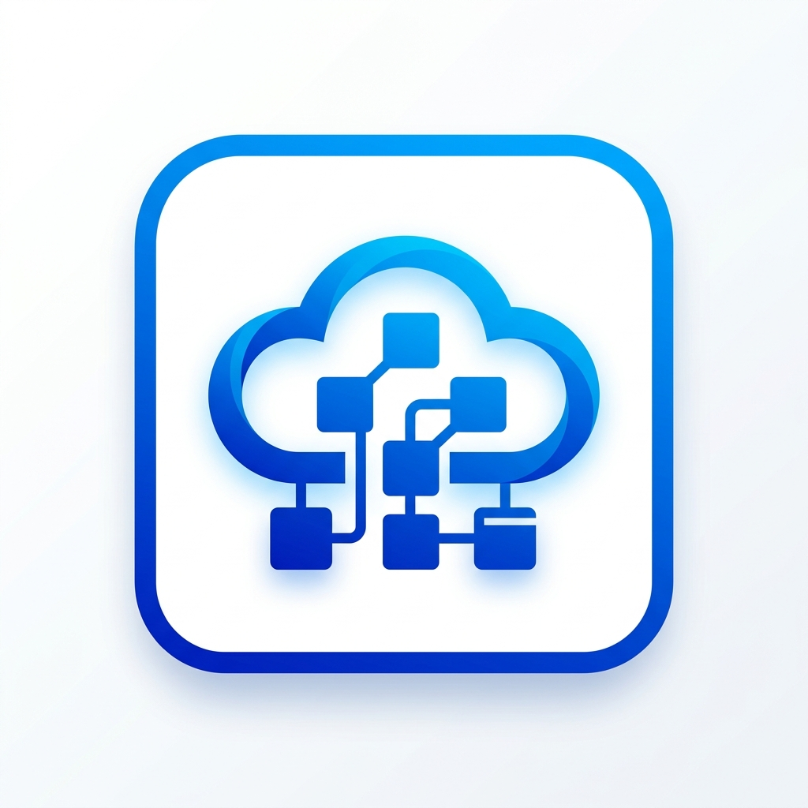
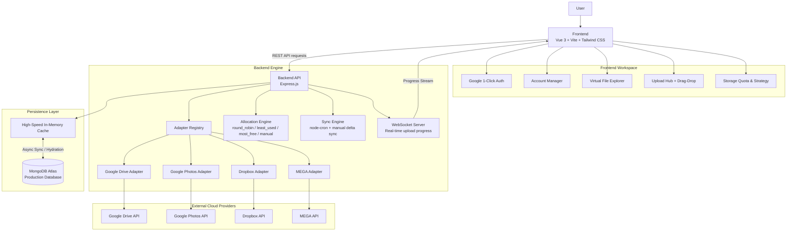

<p align="center">
  
</p>

# OneSpace

[](https://developer.mozilla.org/en-US/docs/Web/JavaScript) [](https://vitejs.dev/) [](https://vuejs.org/) [](https://tailwindcss.com/) [](https://nodejs.org/) [](https://expressjs.com/) [](https://www.mongodb.com/atlas) [](https://render.com/) [](https://developer.mozilla.org/en-US/docs/Web/API/WebSockets_API)

**OneSpace** is a modern, high-performance multi-cloud drive aggregation platform that unifies multiple cloud storage accounts into a single, seamless, and intuitive workspace. Built with Vue 3, Express, and provider-agnostic adapters, OneSpace enables users to browse, upload, download, search, and manage files across all their connected accounts from one unified interface.


---

## ✨ Key Features

### ☁️ Multi-Provider Cloud Aggregation
- Connect multiple cloud storage accounts across different providers in a single application.
- Normalizes disparate APIs (Google Drive, Google Photos, Dropbox, MEGA) through a unified adapter layer.
- Supports OAuth 2.0 redirect flows, direct account authentication, and secure token refresh cycles.

### 🗂️ Unified File Workspace
- **Virtual Path Navigation**: Navigate files and folders seamlessly as if they were on a single local filesystem.
- **Dedicated Views**: `Home` dashboard, `My Drive` explorer, `Recent` files, `Starred` items, `Shared with Me`, and `Storage Quota`.
- Consistent metadata, thumbnails, and preview handling regardless of provider source.

### 📁 Comprehensive File Management
- Explore folders and preview images, documents, and media.
- Create new folders, rename files/folders, download files, and perform bulk deletion.
- Star/unstar items for quick access across supported providers.

### ⬆️ High-Speed Upload Engine
- Multi-file, drag-and-drop, and full folder upload capabilities.
- Real-time chunked streaming and live upload progress via WebSockets.
- **Intelligent Account Allocation**: Automatically selects the destination cloud account according to your configured storage strategy.

### 🔄 Dual Persistence & High-Speed Mirroring
- **Cloud-Ready**: Powered by **MongoDB Atlas** for scalable, serverless cloud persistence across deployments.
- **In-Memory Cache**: Low-latency RAM-backed query engine for instant folder navigation and fast searching.
- **Zero-Config Local Mode**: Automatically falls back to an embedded in-memory database when running offline without MongoDB.
- Scheduled background sync via `node-cron` with manual on-demand sync triggers.

### 👤 Secure Authentication Modes
- **`hosted` Mode**: Multi-user cloud deployment featuring **Google 1-Click OAuth Sign-In** with secure `HttpOnly`, `SameSite=None`, `Secure` session cookies. Eliminates spam registrations and bot accounts.
- **`local` Mode**: Zero-login personal deployment for local machine or home server use.

### 🧠 Smart Storage Allocation Strategies
Distribute uploads dynamically across connected cloud accounts:
- `round_robin`: Cycles evenly across accounts.
- `weighted_round_robin`: Proportional distribution based on account capacity.
- `least_used`: Prioritizes accounts with lowest current usage.
- `most_free`: Automatically directs uploads to the account with the most available bytes.
- `manual`: Enforces your custom priority ordering.

---

## 📸 Screenshots

| My Drive Explorer | Storage Overview |
| :---: | :---: |
|  |  |

| Storage Allocation Settings |
| :---: |
|  |

---

## ☁️ Supported Cloud Providers

| Provider | Status | Integration Model | Scopes / Capabilities |
| :--- | :---: | :--- | :--- |
| **Google Drive** | ✅ Active | OAuth 2.0 (Google Drive API v3) | Full drive file read, write, upload, rename, delete |
| **Google Photos** | ✅ Active | OAuth 2.0 (Photos Library API) | Media item sync, album browsing, metadata indexing |
| **Dropbox** | ✅ Active | OAuth 2.0 (Dropbox API v2) | File management, chunked upload, thumbnail generation |
| **MEGA** | ✅ Active | Direct account connection | Client-side encrypted cloud storage |

> 📖 **Setup Guide**: Detailed steps to get API credentials for all providers are documented in [`provider-setup.md`](provider-setup.md).

---

## 🏗️ Architecture & Data Flow



---

## 🚀 Free Cloud Deployment (Render Blueprint)

You can deploy the complete OneSpace stack (Backend API + Frontend Web) to [Render](https://render.com/) on their **Free Tier** in minutes using the included `render.yaml` Blueprint.

### Prerequisites
1. A free [Render account](https://render.com/).
2. A free [MongoDB Atlas](https://www.mongodb.com/atlas) cluster (M0 Free Tier).
3. A Google Cloud project with OAuth 2.0 credentials (see [`provider-setup.md`](provider-setup.md)).

### Step-by-Step Deployment:

1. **Fork or Push** this repository to your GitHub account:
   ```bash
   git remote add origin https://github.com/YOUR_USERNAME/OneSpace.git
   git push -u origin main
   ```

2. **Create a Free MongoDB Atlas Database**:
   - Go to [MongoDB Atlas](https://www.mongodb.com/atlas) and create a free M0 cluster.
   - Under **Database Access**, create a database user and password.
   - Under **Network Access**, add IP `0.0.0.0/0` (Allow access from anywhere).
   - Click **Connect** → **Drivers** (Node.js) and copy the connection string:
     ```text
     mongodb+srv://<username>:<password>@cluster0.xxxx.mongodb.net/?retryWrites=true&w=majority
     ```

3. **Deploy with Render Blueprint**:
   - In your Render Dashboard, click **New +** → **Blueprint**.
   - Connect your GitHub repository (`OneSpace`).
   - Render will read [`render.yaml`](render.yaml) and automatically configure:
     - `onespace-api`: Node.js Web Service (Oregon, Free Plan)
     - `onespace-web`: Static Site (Global CDN, Free Plan)
   - When prompted for environment variables, fill in:
     - `MONGODB_URI`: Your MongoDB Atlas connection string.
     - `GOOGLE_CLIENT_ID`: Your Google OAuth Client ID.
     - `GOOGLE_CLIENT_SECRET`: Your Google OAuth Client Secret.
     - *(Optional)* `DROPBOX_CLIENT_ID` & `DROPBOX_CLIENT_SECRET`.
   - Click **Apply**.

4. **Update Google Cloud Console Redirect URI**:
   - Go to [Google Cloud Console](https://console.cloud.google.com/) → **APIs & Services** → **Credentials**.
   - Edit your OAuth 2.0 Web Client.
   - Add the following to **Authorized redirect URIs**:
     ```text
     https://onespace-api.onrender.com/api/accounts/google/callback
     ```
   - Click **Save**.

5. **Done!** Open `https://onespace-web.onrender.com`, log in with Google, and start connecting your storage accounts!

---

## 🛠️ Local Development Setup

### 1. Prerequisites
- **Node.js**: v20 or higher
- **npm**: v9 or higher

### 2. Install Dependencies
Clone the repository and install all dependencies:
```bash
git clone https://github.com/chandanraj-03/OneSpace.git
cd OneSpace
npm install
```

### 3. Environment Configuration
Create the backend `.env` file from the example:
```bash
# Windows PowerShell
copy backend/.env.example backend/.env

# Linux / macOS
cp backend/.env.example backend/.env
```

Edit `backend/.env` with your settings:
```env
PORT=8787
APP_MODE=local

CORS_ORIGIN=http://localhost:5173
FRONTEND_URL=http://localhost:5173

SYNC_INTERVAL_MINUTES=5
ONESPACE_SECRET_HALF=change-this-to-a-random-secret

# Optional: Add MongoDB Atlas URI if you want cloud persistence locally
MONGODB_URI=

GOOGLE_CLIENT_ID=your_google_client_id
GOOGLE_CLIENT_SECRET=your_google_client_secret
GOOGLE_REDIRECT_URI=http://localhost:8787/api/accounts/google/callback

DROPBOX_CLIENT_ID=your_dropbox_key
DROPBOX_CLIENT_SECRET=your_dropbox_secret
DROPBOX_REDIRECT_URI=http://localhost:8787/api/accounts/dropbox/callback
```

### 4. Start Development Servers
Run frontend and backend concurrently with hot reloading:
```bash
npm run dev
```

- **Frontend Web UI**: [http://localhost:5173](http://localhost:5173)
- **Backend API**: [http://localhost:8787](http://localhost:8787)

---

## 🐳 Docker Deployment

Run the complete stack using Docker Compose:

```bash
# Build and start services
docker compose up --build

# Stop services
docker compose down
```

The application will be available at:
- **Web App**: `http://localhost:8080`
- **API**: `http://localhost:8080/api`

---

## 📌 Available Scripts

| Command | Description |
| --- | --- |
| `npm run dev` | Run both Vite dev server and Express backend concurrently |
| `npm run build` | Build the frontend production bundle (`frontend/dist`) |
| `npm run build:web` | Build only the frontend |
| `npm run dev:web` | Start only the Vite frontend dev server |
| `npm run dev:api` | Start only the Express API with `node --watch` |
| `npm start` | Start the Express backend production server |

---

## 🔌 API Reference Overview

### 🔐 Authentication
- `GET /api/auth/me`: Retrieve current session and user profile.
- `GET /api/auth/google/url`: Generate Google OAuth 2.0 authorization URL for 1-click sign-in.
- `GET /api/auth/google/callback`: Handle Google OAuth callback and session creation.
- `POST /api/auth/logout`: Invalidate current session and clear auth cookies.

### ☁️ Cloud Accounts
- `GET /api/accounts`: List all connected cloud accounts and their storage quotas.
- `DELETE /api/accounts/:id`: Disconnect and remove a cloud account.
- `GET /api/accounts/:provider/connect`: Initiate OAuth connection flow for Google Drive, Google Photos, or Dropbox.
- `POST /api/accounts/mega/connect`: Connect MEGA account with email/password.
- `POST /api/sync/run`: Trigger immediate synchronization across all connected accounts.

### 🗃️ Virtual Files & Folders
- `GET /api/files?path=/`: List files and folders in a virtual directory.
- `GET /api/files?recent=1`: List recently modified or uploaded files.
- `GET /api/files?starred=1`: List starred files.
- `GET /api/files?shared=1`: List shared items from supported providers.
- `GET /api/files/:id/details`: Get file metadata and download link.
- `PATCH /api/files/:id/star`: Toggle starred state.
- `POST /api/files/bulk/delete`: Bulk delete files and folders across providers.

### ⬆️ Uploads & Storage Allocation
- `POST /api/uploads/initiate`: Initiate upload session and determine target cloud account.
- `POST /api/uploads/:uploadId/stream`: Stream file chunks to target cloud provider.
- `WS /ws/uploads?uploadId=...`: Real-time WebSocket connection for upload progress.
- `GET /api/allocation`: Get active storage allocation strategy.
- `PATCH /api/allocation`: Update allocation strategy (`round_robin`, `most_free`, etc.).

---

## 🔒 Security & Data Privacy

- **No Credential Exposure**: Never commit `.env` or sensitive secret keys.
- **Client Credential Encryption**: Cloud provider tokens are encrypted at rest using AES-256 derived from machine fingerprints and secret key material.
- **Cross-Site Protection**: In hosted mode, auth tokens are transmitted via `HttpOnly`, `SameSite=None`, `Secure` cookies.
- **Spam Mitigation**: Hosted mode enforces verified Google OAuth 2.0 sign-in to eliminate malicious registration vectors.

---

## 👤 Author

**Chandan Raj**
- GitHub: [@chandanraj-03](https://github.com/chandanraj-03)
- Repository: [chandanraj-03/OneSpace](https://github.com/chandanraj-03/OneSpace)

---

## 📄 License

This project is open-source software licensed under the [MIT License](LICENSE).
